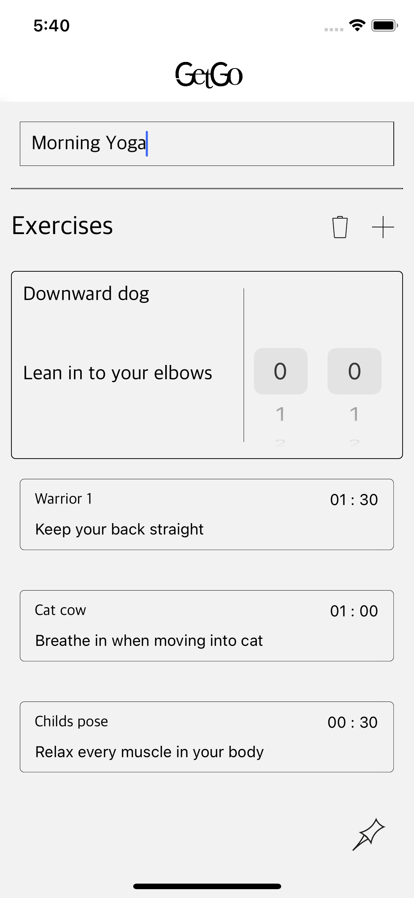

## GETGO

A personalized fitness app

<!--  -->


## Walkthrough

```
When you open the app, at first you will see an empty screen, 
with a logo at the top and an add button at the bottom.

Press the add button to create your first workout

Give the workout a title, and create your first exercise.

When you are happy with this exercise:
press the + button to add an other one.

If you want to edit an exercise: 
press the exercise.

You can also through the list of workouts to see all of them.

If you want to delete a workout:
press it to get it in the edit box, and press the bin button at the top.

When you are scatisfied with your exercise list:
you can press the save button at the bottom of the page
This takes you back to the first page.

As you can see it has now added your workout and tells you it's total duration
You can press the workout, which will take you to an overview of the exercises.

To edit this workout: press the edit button next to the total duration

To start your workout: press the GO! button at the bottom

The workout will play itself
It let you know how many seconds are left
as well as show you a progress bar
When the exercise is finished, this will take you back to the first page.

On this page you can also delete workouts
When you close the app:
the state is saved to your local storage,
When you restart the app you will still have all of your saved workouts.

Have fun!
```

### MPV no. I

Deadline - fri. 11/06/21

[Design](https://www.figma.com/file/1hWRTcunU7XxMsq6zxaSZ4/GetGo?node-id=0%3A1)

``` 
As a user
To choose a workout
I want to be able to see a list of available workouts
```
```
As a user
To personalize my workout schedule
I want to be able to create my own workout
```
```
As a user
To change up my routine
I want to be able to change a workout
```
```
As a user
To see a full workout
I want to see a list of exercises that are part of that workout
```
```
As a user
To do a workout
I want to be able to start my workout and see how far along I am
```
```
As a user
To get rid of workouts that I don't want to do again
I want to be able to delete workouts
```
```
As a user
To remember all of my saved workouts
I want the workout to still be on my phone the next time i open the app
```